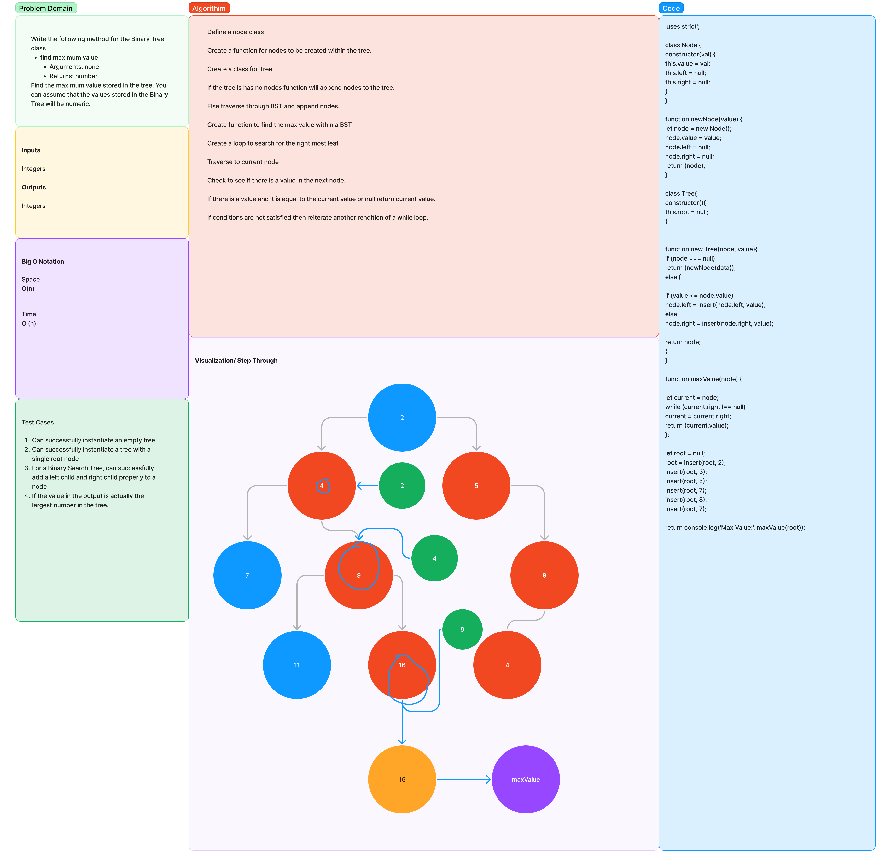

# Trees

In computer science, a tree is a widely used abstract data type that represents a hierarchical tree structure with a set of connected nodes. Each node in the tree can be connected to many children (depending on the type of tree), but must be connected to exactly one parent, except for the root node, which has no parent. These constraints mean there are no cycles or "loops" (no node can be its own ancestor), and also that each child can be treated like the root node of its own subtree, making recursion a useful technique for tree traversal. In contrast to linear data structures, many trees cannot be represented by relationships between neighboring nodes in a single straight line.

## Challenge

Write the following method for the Binary Tree class

find maximum value
Arguments: none
Returns: number
Find the maximum value stored in the tree. You can assume that the values stored in the Binary Tree will be numeric.

## Approach & Efficiency

Getting the nesscary method in the tree class and pass  all tests.

## API

 findLargestValue() method is a function that is used to find the largest value in a binary search tree.

## UML

 

