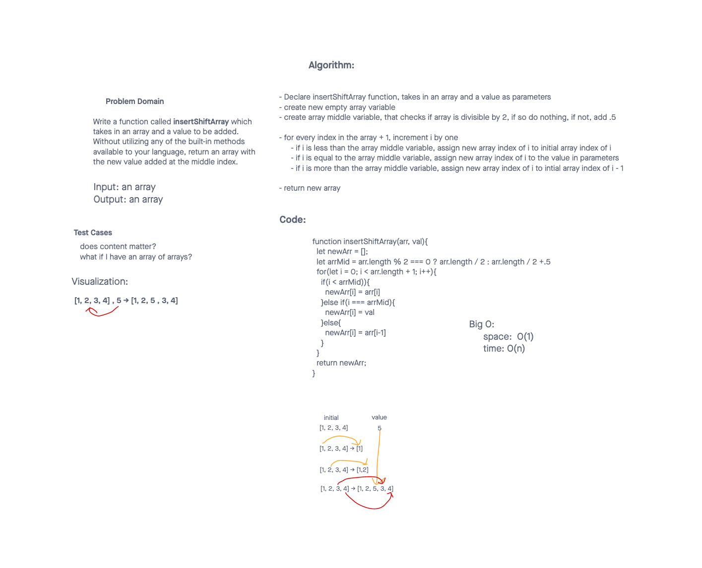

# Insert to Middle of an Array

Write a function called insertShiftArray which takes in an array and a value to be added. Without utilizing any of the built-in methods available to your language, return an array with the new value added at the middle index.

## Whiteboard Process

## Approach & Efficiency

Using a for loop after having a turnary find out where the middle of the array was. The for loop then checked to see where in the array we were at and would put the new value into the middle of the array
