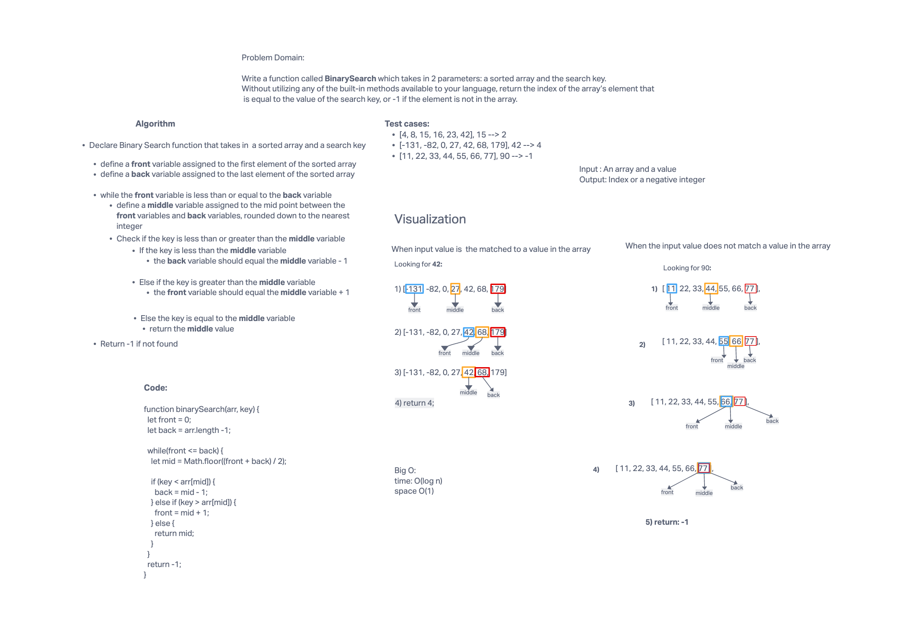

# BinarySearch

Write a function called BinarySearch which takes in 2 parameters: a sorted array and the search key. Without utilizing any of the built-in methods available to your language, return the index of the array’s element that is equal to the value of the search key, or -1 if the element is not in the array.

## Whiteboard Process

## Approach & Efficiency

have a while loop that has a if if else and else to dictate which action would be taken based on the index of the front middle and back values would get us to our final solution. time:O(log n) space:O(1)
