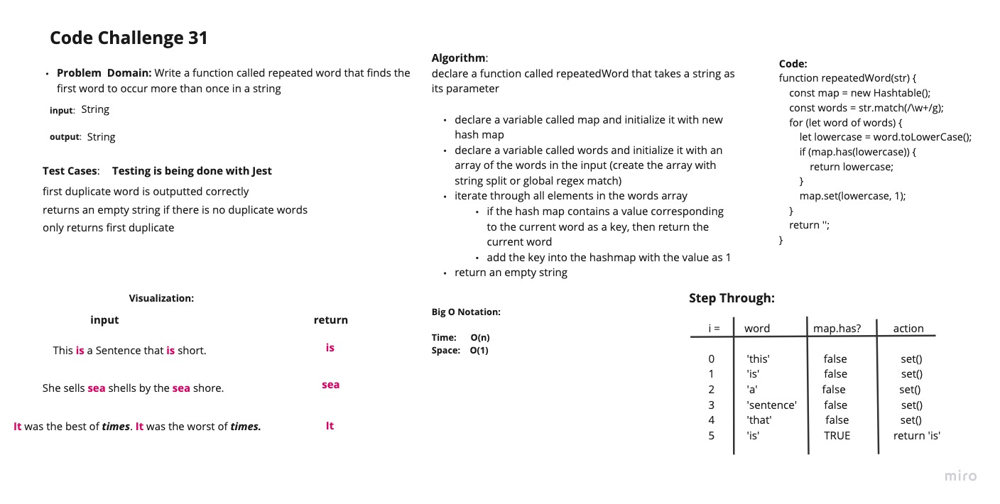

# Hashtables

Hash Table is a data structure which stores data in an associative manner. In a hash table, data is stored in an array format, where each data value has its own unique index value. Access of data becomes very fast if we know the index of the desired data.

Thus, it becomes a data structure in which insertion and search operations are very fast irrespective of the size of the data. Hash Table uses an array as a storage medium and uses hash technique to generate an index where an element is to be inserted or is to be located from.

## Challenge

Feature Tasks
Write a function called repeated word that finds the first word to occur more than once in a string
Arguments: string
Return: string

## Approach & Efficiency

The approach taken in this function is to use a hash table (implemented using an array) to store the words in the input string, and check if each word has been seen before by checking if it is in the hash table. If a word has been seen before, it is returned. If no repeated words are found, an empty string is returned.

## API

set(key, value): This method takes in a key and a value, hashes the key to find the index in the table, and stores the key-value pair in the table. If the key already exists in the table, its value is replaced with the value provided to this method. This method does not return anything.

get(key): This method takes in a key and returns the value associated with that key in the table. If the key is not found in the table, this method returns null.

has(key): This method takes in a key and returns a boolean indicating whether the key exists in the table.

keys(): This method returns a collection of keys in the table.

hash(key): This method takes in a key and returns the index in the table where the key-value pair should be stored. This method uses a hash function to map the key to an index in the table.

## WHiteboard

