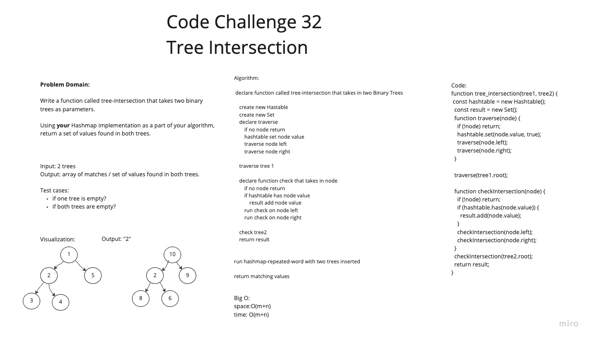

# Hashtables

Hash Table is a data structure which stores data in an associative manner. In a hash table, data is stored in an array format, where each data value has its own unique index value. Access of data becomes very fast if we know the index of the desired data.

Thus, it becomes a data structure in which insertion and search operations are very fast irrespective of the size of the data. Hash Table uses an array as a storage medium and uses hash technique to generate an index where an element is to be inserted or is to be located from.

## Challenge

Write a function called tree_intersection that takes two binary trees as parameters.
Using your Hashmap implementation as a part of your algorithm, return a set of values found in both trees.

## Approach & Efficiency

This function takes in two binary trees, tree1 and tree2, as input. It then performs the following steps:

Initialize an empty Hashtable, hashtable and an empty set, result
It defines a helper function traverse(node) which takes in a node and recursively traverses the tree1, in a depth-first manner, adding the value of each node to the hashtable using the set method of the hashtable class, with the node value as the key and true as the value.
It calls the traverse function with the root of the tree1 as the argument
It defines another helper function checkIntersection(node) which also recursively traverses the tree2, in a depth-first manner, and checks if the value of each node is present in the hashtable using the has method of the hashtable class. If the value is found, it adds the value to the result set using the add method
It calls the checkIntersection function with the root of the tree2 as the argument
It returns the result set
The output of the function is the set of values that are present in both trees.

## API

set(key, value): This method takes in a key and a value, hashes the key to find the index in the table, and stores the key-value pair in the table. If the key already exists in the table, its value is replaced with the value provided to this method. This method does not return anything.

get(key): This method takes in a key and returns the value associated with that key in the table. If the key is not found in the table, this method returns null.

has(key): This method takes in a key and returns a boolean indicating whether the key exists in the table.

keys(): This method returns a collection of keys in the table.

hash(key): This method takes in a key and returns the index in the table where the key-value pair should be stored. This method uses a hash function to map the key to an index in the table.

## WHiteboard

