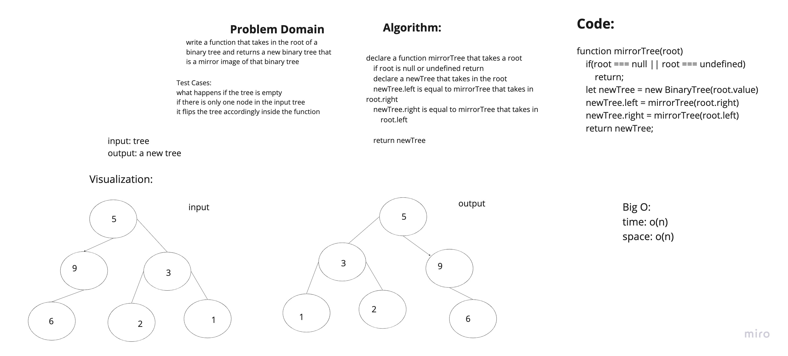

# Challenge

write a function that takes in the root of a binary tree and returns a new binary tree that is a mirror image of that binary tree

## Approach, Efficiency & API

his function takes a binary tree as input and returns a new binary tree that is a mirror image of the original. The function uses a recursive approach to traverse the tree, and for each node in the original tree, it creates a new node with the same value and sets the left child to be the right child of the original node and the right child to be the left child of the original node. This approach has a time complexity of O(n) where n is the number of nodes in the tree, as the function visits each node once. The space complexity is also O(n) as a new tree is created. The API of the function is to call it with the root node of the binary tree to be mirrored as the parameter.

