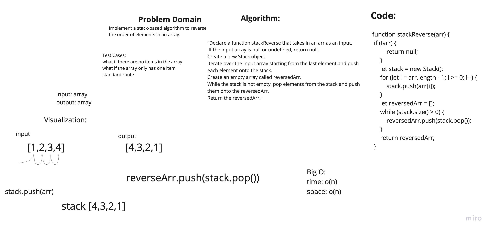

# Challenge

Implement a stack-based algorithm to reverse the order of elements in an array.

## Approach, Efficiency & API

The stackReverse(arr) function takes an input array and reverses its order using a stack data structure. The approach of this function is as follows:

It first checks if the input array is null or undefined, and if so, it immediately returns null.
It then creates a new stack object.
It iterates over the input array starting from the last element and pushes each element onto the stack.
It creates an empty array called reversedArr.
It enters a while loop that continues until the stack is empty. In each iteration of the while loop, it pops an element from the stack and pushes it onto the reversedArr array.
It finally returns the reversedArr array.
The efficiency of this function is O(n) in both time and space, where n is the number of elements in the input array. It takes O(n) time because it iterates over the input array twice, once to push the elements onto the stack, and once to pop the elements off the stack and add them to the reversed array. It takes O(n) space because it creates a new stack and a new reversed array, both of which take up O(n) space in the worst case.

In terms of API, this function takes a single argument, an array, and returns the reversed array. It does not have any additional methods or properties that can be accessed or modified. It's a simple function that receives an array and returns the reversed version of it.

